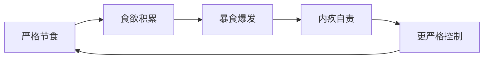

# 行为心理支持

## 核心理念

减脂失败的第一大原因不是"方法不对"，而是"坚持不住"。行为心理学研究表明，可持续的行为改变比完美的饮食方案更重要。

> 「最好的饮食计划，是你能坚持的那一个。」

## 暴食-限制循环

### 循环模型



这是减脂中最常见的心理陷阱。每次暴食后的「弥补」式严格控制，反而为下一次暴食积蓄了更强的驱动力。

### 识别暴食触发因素

| 触发类型 | 常见表现 | 应对策略 |
|---------|---------|---------|
| 情绪触发 | 焦虑、压力大时想吃甜食/油炸食品 | 情绪记录：每次想吃时先问「我是饿了还是情绪不好？」 |
| 社交触发 | 聚餐时不好意思拒绝、被劝食 | 提前声明：「最近在控制饮食，少吃点」 |
| 限制触发 | 越禁止某食物越想吃 | 不要完全禁止，安排计划内放纵餐 |
| 环境触发 | 看到食物广告、路过奶茶店 | 提前规划路线、删掉外卖 APP 推送通知 |
| 习惯触发 | 看剧就吃零食、加班就点外卖 | 替换习惯（看剧喝茶、加班备水果） |

### 打破循环的关键

1. **允许不完美** — 一次暴食不会毁掉所有成果。1 顿暴食多摄入 2000 kcal，相当于约 250g 脂肪，而一个 4 周周期的总缺口通常是 14000-20000 kcal
2. **暴食后不停滞** — 第二天正常执行计划，不加倍运动、不节食弥补。弥补式行为会强化内疚-暴食循环
3. **记录但不审判** — 记录暴食触发因素（情绪/事件/时间），用于识别规律，而非自我批评

## 动机管理

### 内在动机 vs 外在动机

| 类型 | 示例 | 持久性 |
|------|------|--------|
| 外在动机 | 「体检指标要达标」「家人要我减肥」 | 弱，容易消退 |
| 内在动机 | 「我想有精力陪孩子玩」「我不想再为体重焦虑」 | 强，持久 |

**建议：** 帮用户找到 1-2 个深层内在动机，在低谷时提醒他们。

### 动机衰退的常见阶段

| 阶段 | 时间 | 表现 | 应对 |
|------|------|------|------|
| 蜜月期 | 第 1-2 周 | 充满热情，严格执行 | 利用动力建立习惯，但不要过度承诺 |
| 现实期 | 第 3-4 周 | 新鲜感消退，开始觉得麻烦 | 回顾已取得的进展，关注非体重变化 |
| 平台期 | 第 5-8 周 | 体重下降放缓或停滞 | 解释平台期正常性，参考 plateau.md |
| 倦怠期 | 第 9-12 周 | 反复出现「算了吧」的念头 | 回顾初始动机，适当调整计划增加新鲜感 |

## 习惯养成

### 习惯回路模型

```
提示 → 行为 → 奖励
```

**建立健康习惯的关键：** 让提示更明显、让行为更简单、让奖励更即时。

### 实用策略

| 策略 | 示例 |
|------|------|
| 环境设计 | 家里不放零食、水果放在显眼位置、运动装备提前准备好 |
| 习惯叠加 | 「刷牙后称体重」「下班后换运动鞋」「吃完饭后立刻洗碗（避免久坐）」 |
| 最小可行行动 | 不想运动时，告诉自己「只走 10 分钟」——开始后通常会继续 |
| 执行意图 | 用「如果…就…」句式：「如果下午 3 点饿了，就吃个苹果」 |

### 21 天 vs 66 天

研究发现习惯养成平均需要 **66 天**（范围 18-254 天），而非广为流传的 21 天。前 4 周是关键期，此时外部支持（打卡、监督、鼓励）效果最大。

## 社交场景应对

### 中国职场饮食文化

| 场景 | 压力来源 | 应对策略 |
|------|---------|---------|
| 饭局应酬 | 劝酒、劝菜是社交礼仪 | 提前说「医生让控制」，用茶/苏打水代酒 |
| 下午茶 | 同事点奶茶/蛋糕 | 自备无糖酸奶或坚果，参与社交但不摄入高热量 |
| 加班外卖 | 集体点餐不便单独点 | 提前说明饮食需求，或自备便当 |
| 节假日 | 走亲访友必须吃好 | 计划内放纵——允许节日当天放松，节后立刻恢复 |

### 沟通技巧

- **不用「减肥」这个词** — 改说「改善饮食」「调整身体」「健康管理」，减少外界压力
- **不解释太多** — 「最近在注意饮食」就够了，不需要展开
- **找盟友** — 如果身边有人也在减脂，相互支持的效果显著优于独自坚持

## 正向反馈设计

### 关注多维进步

体重不是唯一指标。当体重停滞时，引导用户关注：

| 维度 | 可感知的变化 |
|------|------------|
| 体能 | 爬楼梯不喘了、能走更远、运动后恢复更快 |
| 饮食 | 对甜食/油炸的渴望降低、自然吃到七分饱就停 |
| 睡眠 | 入睡更快、醒来更精神 |
| 情绪 | 对体重的焦虑减少、自我感觉更好 |
| 衣着 | 衣服变松了、腰带需要收紧 |
| 指标 | 体检数据改善（TG、ALT 等） |

### 称重的心理管理

- **频率建议：** 每天 1 次（固定时间、固定条件），用于观察趋势
- **正确心态：** 单日波动 ≠ 趋势。体重受水分、排泄、饮食时机影响，日波动 0.5-2 kg 属正常
- **危险信号：** 如果每天称重导致焦虑、情绪大起大落，可改为每周 1 次
- **记录方式：** 关注 7 天移动平均线，而非单日数值

### 鼓励话术参考

| 情况 | 鼓励方向 |
|------|---------|
| 体重下降 | 「这一周期的努力有了回报，继续保持」 |
| 体重不变 | 「体重没变不等于没进步。肌肉增加/水分波动都会掩盖脂肪减少。看趋势而非单周数据」 |
| 体重反弹 | 「短期反弹通常是水分（尤其高钠饮食后）。回顾这周的非体重进步：体能、饮食选择、精神状态」 |
| 暴食后 | 「暴食不等于失败。重要的是你还在继续执行计划。一次暴食在 4 周总热量中占比很小」 |
| 平台期 | 「平台期说明身体在适应新的体重水平。坚持住，调整运动或饮食就能突破」 |

## 何时寻求专业帮助

以下情况建议转介心理咨询：

- 频繁暴食（每周 ≥ 2 次）且无法自控
- 进食后催吐或使用泻药
- 对食物产生强烈恐惧，极度限制饮食
- 体重焦虑严重影响工作和社交
- 长期失眠伴随情绪低落
