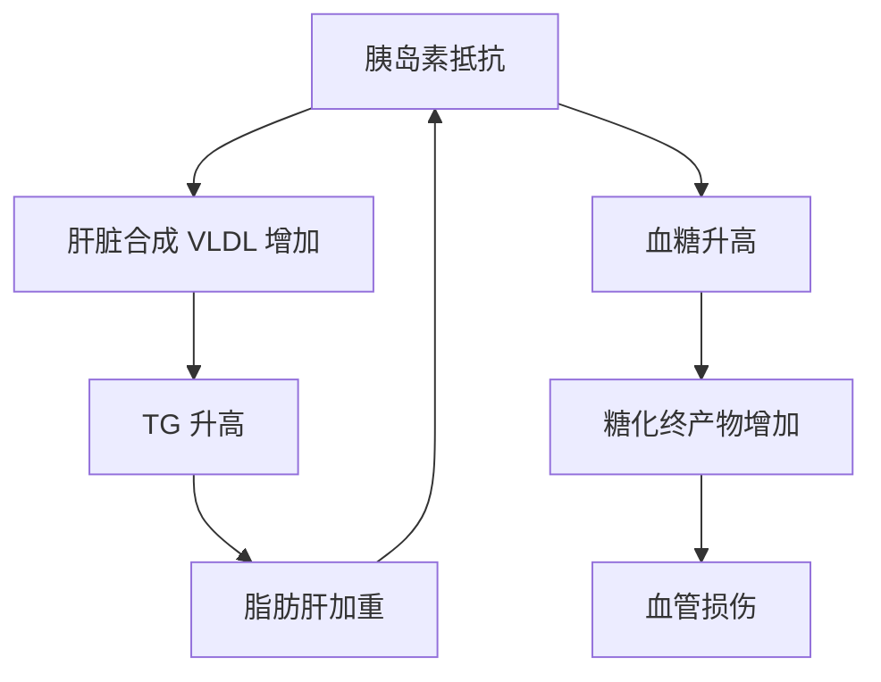

# 血糖管理

## 参考范围（中国糖尿病防治指南 2024 版）

### 空腹血糖（FPG）

| 分类 | 空腹血糖 |
|------|---------|
| 正常 | < 6.1 mmol/L |
| 空腹血糖受损（IFG） | 6.1 - 6.9 mmol/L |
| 糖尿病 | ≥ 7.0 mmol/L |

### 糖化血红蛋白（HbA1c）

| 分类 | HbA1c |
|------|-------|
| 正常 | < 5.7% |
| 糖尿病前期 | 5.7% - 6.4% |
| 糖尿病 | ≥ 6.5% |

### 餐后 2 小时血糖（OGTT）

| 分类 | 餐后 2h 血糖 |
|------|-------------|
| 正常 | < 7.8 mmol/L |
| 糖耐量异常（IGT） | 7.8 - 11.0 mmol/L |
| 糖尿病 | ≥ 11.1 mmol/L |

> **中国标准 vs ADA 标准：** 中国指南的空腹血糖受损切点为 6.1 mmol/L（WHO 标准），而美国糖尿病协会（ADA）使用 5.6 mmol/L。本项目采用中国标准。

## 糖尿病前期

### 定义

空腹血糖受损（IFG）和/或糖耐量异常（IGT）统称为糖尿病前期。这是发展为 2 型糖尿病的高危状态。

### 进展风险

| 状态 | 每年进展为糖尿病的概率 |
|------|---------------------|
| 单纯 IFG | 5-8% |
| 单纯 IGT | 5-8% |
| IFG + IGT 合并 | 10-15% |

### 逆转可能性

**生活方式干预可使糖尿病前期进展为糖尿病的风险降低 58%。**

| 干预措施 | 效果 |
|---------|------|
| 减重 5-7% | 胰岛素敏感性显著改善 |
| 每周 150 分钟中等强度运动 | 降低进展风险 40-60% |
| 低 GI 饮食 | 降低餐后血糖峰值 20-30% |
| 减少精制碳水 | 降低空腹血糖 0.3-0.5 mmol/L |

## 血糖与甘油三酯的关系

高 TG 和高血糖经常同时出现，它们有共同的病理基础：

**关键机制：**

- **高 TG → 血糖升高：** 游离脂肪酸增多会抑制肌肉对葡萄糖的摄取，加重胰岛素抵抗
- **高血糖 → TG 升高：** 胰岛素抵抗导致脂蛋白脂酶活性降低，TG 分解减少
- **高果糖 → 同时升高两者：** 果糖在肝脏代谢时会同时促进脂肪合成（升 TG）和胰岛素抵抗（升血糖）

### 同时存在高 TG 和高血糖时的饮食策略

| 策略 | 原因 |
|------|------|
| 严格限制果糖 | 果糖同时促进脂肪合成和胰岛素抵抗 |
| 选择低 GI 主食 | 低 GI 食物引起的血糖波动更小 |
| 增加可溶性纤维 | 延缓糖的吸收，降低餐后血糖峰值 |
| 每餐蛋白质充足 | 蛋白质延缓胃排空，减缓碳水吸收速度 |
| 避免空腹运动 | 空腹运动可能导致血糖波动 |
| 进餐顺序：蔬菜 → 蛋白 → 主食 | 实证可降低餐后血糖峰值 30-40% |

## 果糖：被忽视的风险

### 果糖与葡萄糖的区别

| 特征 | 葡萄糖 | 果糖 |
|------|--------|------|
| 吸收方式 | 需要胰岛素介导 | 不依赖胰岛素 |
| 代谢场所 | 全身细胞 | 主要在肝脏 |
| 饱腹信号 | 刺激瘦素和胰岛素分泌 | 不刺激饱腹信号 |
| 对 TG 的影响 | 中等 | 强烈促进肝脏脂肪合成 |
| 对血糖的影响 | 直接升高 | 间接升高（通过胰岛素抵抗） |

### 果糖来源

| 来源 | 果糖含量 | 建议 |
|------|---------|------|
| 含糖饮料（蔗糖 = 50% 果糖） | 极高 | 完全避免 |
| 果汁（即使鲜榨） | 高 | 避免，吃完整水果代替 |
| 蜂蜜 | 高 | 少量（每天 ≤ 1 勺） |
| 高果糖水果（葡萄、芒果、荔枝） | 中高 | 每天限 1 份（200g 以内） |
| 低果糖水果（苹果、柚子、蓝莓） | 中低 | 每天 1-2 份 |
| 加工食品（高果糖玉米糖浆） | 极高 | 完全避免 |

> **建议：** 对于同时存在高 TG 和高血糖的用户，果糖限制应优先于总碳水限制。含糖饮料是果糖的第一大来源。

## 可溶性纤维的血糖调节作用

### 作用机制

可溶性纤维在肠道中形成凝胶状物质，延缓葡萄糖的吸收速度，从而降低餐后血糖峰值。

### 富含可溶性纤维的食物

| 食物 | 可溶性纤维含量（每 100g） |
|------|------------------------|
| 燕麦 | 5.3 g |
| 黑豆 | 3.1 g |
| 亚麻籽 | 2.7 g |
| 苹果（带皮） | 1.7 g |
| 胡萝卜 | 1.5 g |
| 红薯 | 1.4 g |
| 西兰花 | 1.2 g |

### 推荐摄入量

- 中国营养学会建议：膳食纤维每天 25-30 g
- 其中可溶性纤维建议 ≥ 6 g
- 实际上大多数中国成年人每天仅摄入 10-15 g

## 血糖监测建议

### 哪些人需要关注血糖

- 空腹血糖 ≥ 5.6 mmol/L 的用户（即使未达中国 IFG 标准，也值得关注）
- 同时存在 TG 升高和中心性肥胖的用户
- 有糖尿病家族史的用户
- HbA1c ≥ 5.7% 的用户

### 建议监测频率

| 风险等级 | 监测建议 |
|---------|---------|
| 正常（FPG < 5.6） | 每年体检复查 |
| 边缘（FPG 5.6-6.0） | 每 6 个月查空腹血糖 + HbA1c |
| IFG（FPG 6.1-6.9） | 每 3 个月查 HbA1c，考虑 OGTT |
| 糖尿病（FPG ≥ 7.0） | 建议就医，遵医嘱监测 |
