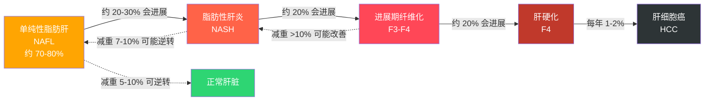
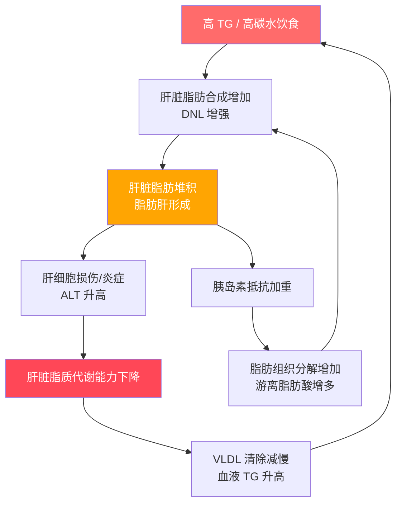

# 脂肪肝（Fatty Liver Disease）

## 概述

正常肝脏脂肪含量约占肝脏湿重的 5%，超过 5% 即为脂肪肝。非酒精性脂肪肝（NAFLD）与代谢综合征密切相关。

### 流行病学数据

| 数据项 | 数值 |
|--------|------|
| 中国成年人 NAFLD 患病率 | 约 25-30%（2020 年代数据） |
| 全球成年人患病率 | 约 25-32% |
| 肥胖人群中 NAFLD 患病率 | 约 60-80% |
| 2 型糖尿病患者中 NAFLD 患病率 | 约 55-70% |
| NAFLD 患者合并高 TG 的比例 | 约 50-60% |
| 单纯性脂肪肝（NAFL）比例 | 约 70-80% 的 NAFLD |
| 脂肪性肝炎（NASH）比例 | 约 20-30% 的 NAFLD |

> NAFLD 已成为中国第一大慢性肝病，患病率已超过病毒性肝炎。

## 分度标准（B 超诊断）

| 分度 | 表现 | 肝脏脂肪含量 |
|------|------|-------------|
| 轻度 | 肝脏回声增强，管道结构尚清 | 5-10% |
| 中度 | 肝脏回声明显增强，管道结构模糊 | 10-25% |
| 重度 | 肝脏回声显著增强，管道结构显示不清，肝脏增大 | > 25% |

> B 超的局限性：对轻度脂肪肝敏感性较低（约 60-80%），脂肪含量需达到 20% 以上才能可靠检出。也就是说，B 超"正常"不能完全排除脂肪肝。

## 脂肪肝严重程度的综合判断

B 超分度只是影像学层面。完整的严重程度评估需要结合以下几个维度：

### 维度 1：脂肪堆积程度（影像学）

即上述 B 超分度。反映的是肝脏里有多少脂肪，但不代表肝脏损伤程度。

### 维度 2：肝细胞损伤（肝功能）

| ALT 水平 | 意义 |
|---------|------|
| 正常范围 | 无明显肝细胞损伤（但不排除 NASH） |
| 1-2 倍正常上限 | 轻度肝细胞损伤，可能已进入 NASH 阶段 |
| 2-3 倍正常上限 | 中度损伤，需积极干预 |
| > 3 倍正常上限 | 严重损伤，需限制运动强度，必要时药物干预 |

> **重要提示：** 约 20-30% 的 NASH 患者 ALT 在正常范围内。ALT 正常 ≠ 肝脏安全。需结合其他指标综合判断。

### 维度 3：纤维化程度（决定预后）

纤维化是脂肪肝严重程度的**最关键指标**，决定了未来进展为肝硬化和肝癌的风险。

| 纤维化分期 | 含义 | 预计进展到下一期时间 | 特征 |
|-----------|------|---------------------|------|
| F0 | 无纤维化 | — | 肝脏结构正常 |
| F1 | 轻度纤维化 | 约 7-10 年 | 汇管区纤维扩张 |
| F2 | 中度纤维化 | 约 5-7 年 | 纤维间隔形成 |
| F3 | 重度纤维化（进展期） | 约 3-5 年 | 大量纤维间隔，结构紊乱 |
| F4 | 肝硬化 | 不可逆（可延缓） | 假小叶形成，肝功能失代偿 |

> **关键数据：** 约 20% 的 NASH 合并进展期纤维化（F3-F4）患者会在 5-10 年内进展为肝硬化。

### 纤维化风险评估（无创方法）

| 方法 | 适用场景 | 说明 |
|------|---------|------|
| FIB-4 指数 | 筛查工具 | = (年龄 × AST) / (血小板 × √ALT)，简单易算 |
| FibroScan（肝脏弹性检测） | 定量评估 | 测量肝脏硬度，无创、快速 |
| NAFLD 纤维化评分（NFS） | 风险分层 | 综合年龄、BMI、糖尿病、血小板、白蛋白、AST/ALT |

#### FIB-4 快速判断

| FIB-4 值 | 风险评估 | 建议 |
|----------|---------|------|
| < 1.3 | 进展期纤维化可能性低 | 继续生活方式干预，定期随访 |
| 1.3 - 2.67 | 中等风险 | 建议进一步检查（FibroScan 或肝专科） |
| > 2.67 | 进展期纤维化可能性高 | 需转诊肝专科，评估是否需要肝活检 |

> **在线计算器：** 搜索 "FIB-4 calculator" 即可找到在线计算工具，输入年龄、ALT、AST、血小板即可。

## NAFLD 疾病进展路径

### 各阶段特征

| 阶段 | 肝脏状态 | 症状 | 可逆性 |
|------|---------|------|--------|
| NAFL（单纯性脂肪肝） | 脂肪堆积，无炎症 | 通常无症状 | **可逆**，减重 5-10% |
| NASH（脂肪性肝炎） | 脂肪堆积 + 炎症 + 肝细胞损伤 | 可能疲劳、右上腹不适 | **可逆**，但需更大力度的干预 |
| 纤维化 F1-F2 | 纤维组织开始增生 | 通常无症状 | **可改善**，减重 10%+ |
| 纤维化 F3 | 大量纤维组织 | 可能出现疲倦、食欲下降 | **部分可逆**，需医疗干预 |
| 肝硬化 F4 | 肝脏结构重建 | 腹水、黄疸、出血倾向 | **不可逆**，可延缓进展 |
| 肝细胞癌 | 恶性肿瘤 | 体重下降、腹痛、黄疸 | 需肿瘤治疗 |

> **好消息：** 大多数脂肪肝患者停留在 NAFL 阶段，不会进展。关键在于识别谁会进展——纤维化程度是最重要的预测因子。

## 脂肪肝与高 TG 的恶性循环

### 为什么脂肪肝会让 TG 更难降

| 原因 | 机制 |
|------|------|
| 肝脏 VLDL 产出增加 | 堆积的脂肪被打包为 VLDL 输出，直接升高血液 TG |
| 脂蛋白脂酶活性下降 | 肝功能受损后，清除血液 TG 的酶活性降低 |
| 胰岛素抵抗加重 | 脂肪肝本身就是胰岛素抵抗的重要来源 |
| 胆汁酸代谢异常 | 影响脂质消化吸收的调节 |

> **正反馈循环：** 脂肪肝越重 → TG 越难降 → 脂肪肝越重。尽早干预的意义在于打断这个正反馈。

## 肝功能指标参考范围

| 指标 | 正常范围 | 升高意义 |
|------|---------|---------|
| ALT（丙氨酸转氨酶） | 9-50 U/L（男），7-35 U/L（女） | 肝细胞损伤标志 |
| AST（天冬氨酸转氨酶） | 15-40 U/L | 肝细胞或心肌损伤 |
| GGT（γ-谷氨酰转肽酶） | 10-60 U/L | 胆道疾病、酒精性肝损伤 |

> 参考：《非酒精性脂肪性肝病防治指南（2018 年更新版）》

### ALT/AST 比值的意义

| AST/ALT 比值 | 可能提示 |
|-------------|---------|
| < 1 | 典型 NAFLD 表现，ALT > AST |
| > 1 | 需警惕进展性纤维化或酒精性肝病 |
| > 2 | 高度怀疑肝硬化 |

## 不控制的后果

### 心血管疾病（脂肪肝患者的头号死因）

| 数据 | 内容 |
|------|------|
| 脂肪肝患者首要死因 | 心血管疾病（而非肝病本身） |
| NAFLD 患者心血管事件风险 | 比无脂肪肝者高 1.5-2 倍 |
| NAFLD + 高 TG | 心血管事件风险进一步叠加 |
| 动脉粥样硬化加速 | 肝脏胰岛素抵抗促进全身炎症和血管内皮损伤 |

### 肝硬化

| 数据 | 内容 |
|------|------|
| NASH → 肝硬化 | 每个纤维化阶段约需 6-10 年 |
| 肝硬化 5 年存活率 | 代偿期约 90%，失代偿期约 50% |
| 失代偿期表现 | 腹水、食管胃底静脉曲张出血、肝性脑病 |
| 是否需要肝移植 | 失代偿期肝硬化可能需要，NAFLD 已成为肝移植第二大原因 |

### 肝细胞癌（HCC）

| 数据 | 内容 |
|------|------|
| 肝硬化患者每年 HCC 发生率 | 约 1-2%（需每 6 个月超声筛查） |
| NASH 相关 HCC 的特点 | 可在未发展至肝硬化前即发生（虽然少见） |
| NAFLD 相关 HCC 占比 | 在肝癌中的占比逐年上升 |

### 代谢紊乱全面恶化

| 影响 | 机制 |
|------|------|
| 2 型糖尿病风险增加 | NAFLD 患者糖尿病风险增加 2-3 倍 |
| 高血压风险增加 | 胰岛素抵抗促进交感神经兴奋和钠潴留 |
| 慢性肾病风险增加 | 约 1.5-2 倍，与全身炎症和氧化应激相关 |
| 高尿酸血症 | 肝脏尿酸代谢受损 + 果糖摄入共同作用 |

## 逆转条件

- **轻度脂肪肝**：通过减重 5-10% 和改善生活方式，3-6 个月内可能逆转
- **中度脂肪肝**：需要减重 7-10%，6-12 个月持续改善
- **重度脂肪肝**：需要减重 10% 以上，可能需要 1-2 年

### 减重与脂肪肝改善的量化关系

| 减重幅度 | 肝脏改善 |
|---------|---------|
| 3-5% | 肝脏脂肪含量减少，ALT 可能开始下降 |
| 5-7% | 脂肪肝程度可能减轻一个等级 |
| 7-10% | NASH 可能缓解（炎症消退、肝细胞损伤减轻） |
| > 10% | 纤维化可能逆转（F2-F3 → F0-F1） |

## 逆转策略

1. **减重是核心**：体重每下降 1%，脂肪肝改善约 1.5%
2. **饮食调整**：低糖低脂高纤维，地中海饮食模式推荐
3. **规律运动**：有氧 + 抗阻结合效果最佳
4. **戒酒**：酒精加重肝脏负担，脂肪肝患者应完全戒酒
5. **控制合并症**：血糖、血脂、血压同步管理

## 运动禁忌和注意事项

### 禁忌

- 重度脂肪肝伴 ALT > 3 倍正常上限：避免高强度运动
- 肝硬化患者：避免对抗性运动和腹部撞击
- 合并严重心血管疾病：需医生评估后制定运动方案

### 注意事项

- 运动前建议检测肝功能
- 以中等强度有氧运动为主
- 避免空腹长时间运动（防止低血糖）
- 运动中出现右上腹不适应立即停止
- 运动后补充充足水分

## 逆转时间线

| 时间节点 | 预期改善 |
|---------|---------|
| 4 周 | 体重下降 2-4%，肝功能指标可能开始改善 |
| 8 周 | 体重累计下降 5-8%，ALT/AST 可能恢复正常 |
| 12 周 | 体重累计下降 8-10%，B 超可能显示脂肪肝减轻一个等级 |
| 24 周 | 巩固效果，脂肪肝可能完全逆转（轻度患者） |

## 监测建议

| 频率 | 检查项目 |
|------|---------|
| 每 3 个月 | 肝功能（ALT、AST、GGT）、血脂（TG、TC、HDL、LDL） |
| 每 6 个月 | 肝脏 B 超、空腹血糖 + HbA1c |
| 每年 | FibroScan 或 FIB-4 评估、全面体检 |
| 已有纤维化（F2+） | 每 6 个月肝脏 B 超筛查 HCC |
