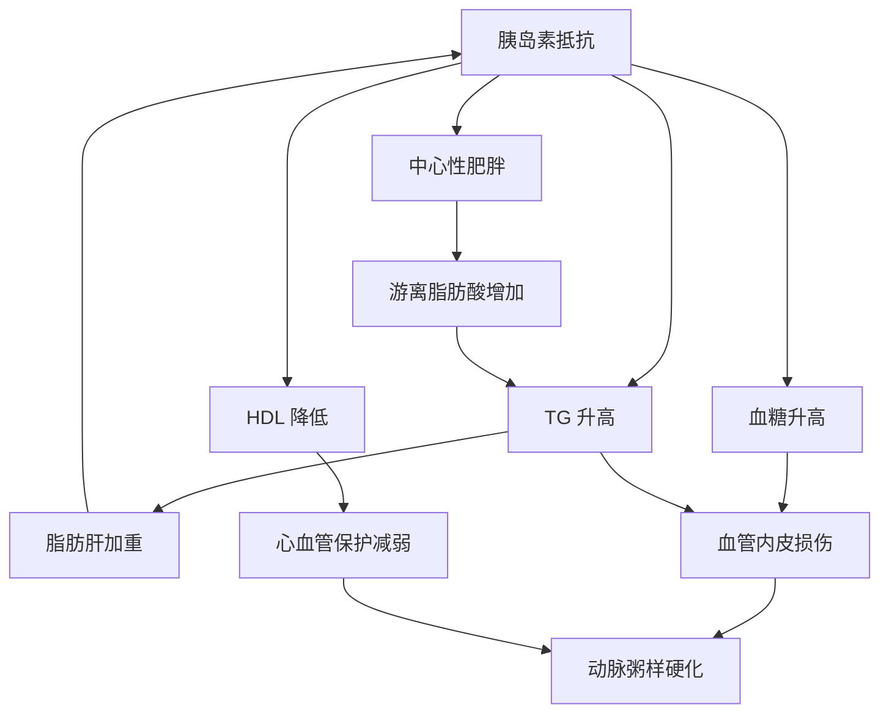

# 代谢综合征

## 定义

代谢综合征（Metabolic Syndrome, MetS）是一组以中心性肥胖、血脂异常、高血糖、高血压为特征的临床综合征。这些因素同时存在时，心血管疾病和 2 型糖尿病的风险呈倍数增长。

## 诊断标准

### 中国糖尿病学会（CDS）标准

符合以下 **≥ 3 项** 即可诊断：

| 组分 | 诊断切点 |
|------|---------|
| 中心性肥胖 | 腰围 ≥ 90 cm（男）/ ≥ 85 cm（女） |
| 甘油三酯升高 | ≥ 1.7 mmol/L 或已接受降 TG 治疗 |
| HDL-C 降低 | < 1.0 mmol/L（男）/ < 1.3 mmol/L（女）或已接受升 HDL 治疗 |
| 血压升高 | ≥ 130/85 mmHg 或已接受降压治疗 |
| 空腹血糖升高 | ≥ 6.1 mmol/L 或已确诊糖尿病 |

> 中国人群腰围切点低于国际标准（WHO：男 ≥ 94 cm / 女 ≥ 80 cm），因为亚洲人在较低体脂水平就会出现代谢风险。

## 各组分的联动关系

**核心机制：** 胰岛素抵抗是代谢综合征的中心环节。内脏脂肪堆积 → 游离脂肪酸入血增加 → 肝脏合成更多 TG → 脂肪肝加重 → 胰岛素抵抗进一步恶化，形成恶性循环。

## 风险评估

### 符合项数与风险等级

| 符合项数 | 风险等级 | 说明 |
|---------|---------|------|
| 1-2 项 | 关注 | 存在代谢风险因素，需针对性干预 |
| 3 项 | 代谢综合征 | 心血管疾病风险增加 2 倍，糖尿病风险增加 5 倍 |
| 4-5 项 | 高危 | 心血管疾病风险增加 3-4 倍，需积极综合管理 |

### 与本项目的关联

目标用户（TG 偏高 + 脂肪肝）通常已满足 2 项标准。如果同时存在超重/肥胖或血糖异常，很可能已达到代谢综合征诊断。

**减重对代谢综合征各组分的改善效果：**

| 减重幅度 | TG | HDL | 血糖 | 血压 |
|---------|-----|-----|------|------|
| 3-5% | ↓ 10-15% | ↑ 3-5% | 改善胰岛素敏感性 | ↓ 2-3 mmHg |
| 5-10% | ↓ 15-25% | ↑ 5-10% | 显著改善 | ↓ 5-10 mmHg |
| 10-15% | ↓ 20-40% | ↑ 10-15% | 糖尿病前期可逆转 | ↓ 10-15 mmHg |

## 综合干预策略

代谢综合征的干预必须多组分同时进行，单一指标达标不足以降低整体风险。

### 优先级排序

1. **减重（核心）** — 体重下降 5-10% 可改善所有组分
2. **降低 TG** — 控制精制碳水 + 增加 Omega-3
3. **提升 HDL** — 规律有氧运动是最有效手段
4. **控制血糖** — 低 GI 饮食 + 减少果糖摄入
5. **管理血压** — 限钠（< 5g/天）+ 运动

### 饮食模式推荐

**地中海饮食 + 低 GI 组合：**

| 食物类别 | 推荐 | 限制 |
|---------|------|------|
| 主食 | 全谷物、杂豆、薯类 | 白米白面、含糖饮料 |
| 蛋白质 | 鱼类（每周 ≥ 2 次）、豆制品、禽肉 | 红肉（每周 ≤ 2 次）、加工肉 |
| 脂肪 | 橄榄油、坚果、深海鱼 | 动物油脂、反式脂肪 |
| 蔬果 | 每天蔬菜 ≥ 500g、水果 200-350g | 果汁、蜜饯 |
| 乳制品 | 低脂/脱脂 | 全脂、含糖酸奶 |

### 运动处方

| 参数 | 建议 |
|------|------|
| 有氧运动 | 每周 ≥ 150 分钟中等强度（快走、游泳、骑车） |
| 阻力训练 | 每周 2-3 次，覆盖大肌群 |
| 运动时长 | 每次 30-60 分钟 |
| 强度 | 最大心率 60-70%（燃脂区间） |

> 同时合并 TG 升高和 HDL 降低时，有氧运动对改善这两个指标的效果最显著。建议将有氧运动作为代谢综合征患者的运动处方核心。

## 血压基础参考

| 分类 | 收缩压 | 舒张压 |
|------|--------|--------|
| 正常 | < 120 | < 80 |
| 正常高值 | 120-139 | 80-89 |
| 1 级高血压 | 140-159 | 90-99 |
| 2 级高血压 | 160-179 | 100-109 |
| 3 级高血压 | ≥ 180 | ≥ 110 |

> 如果用户提供了血压数据，应在评估中纳入代谢综合征综合分析。
