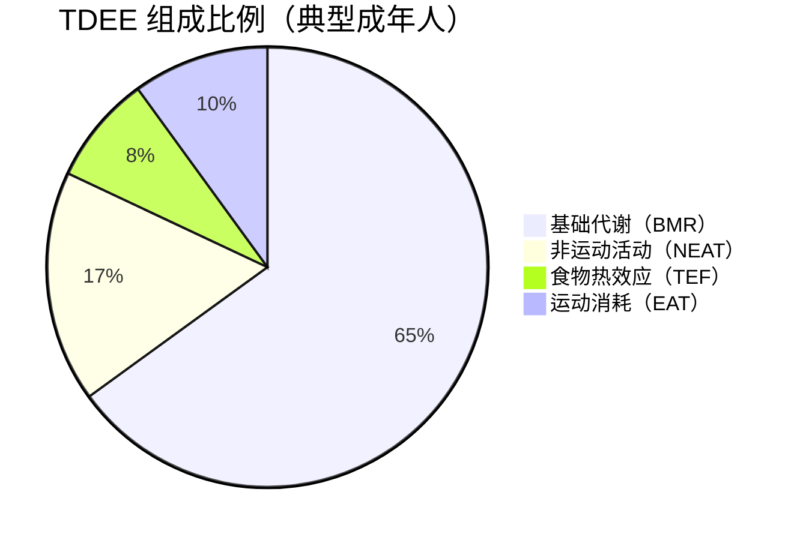
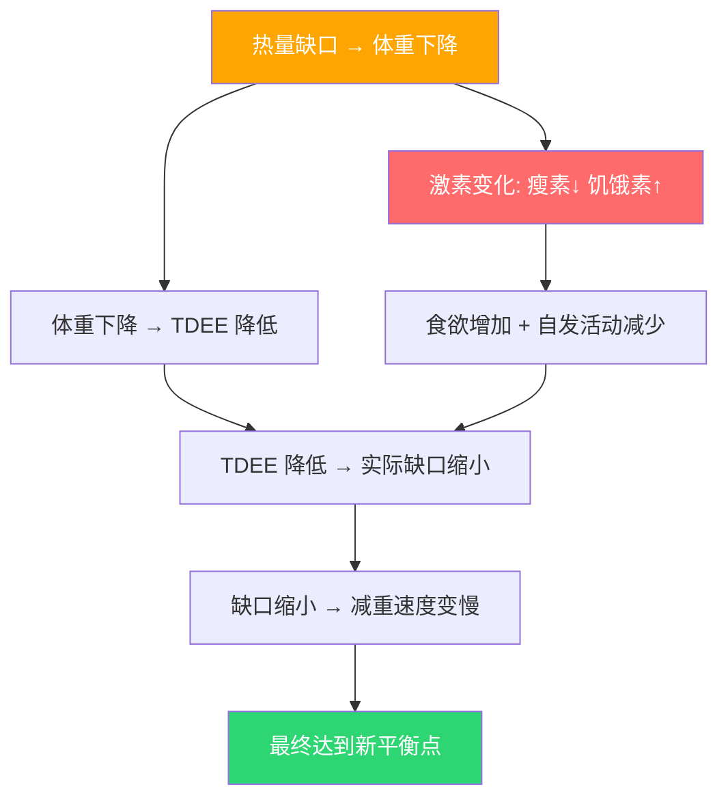
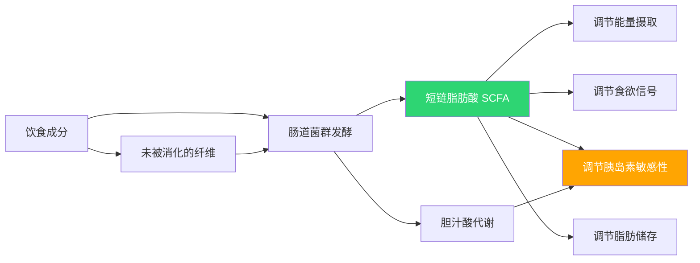
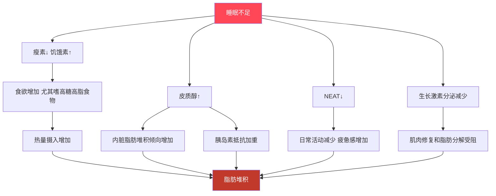
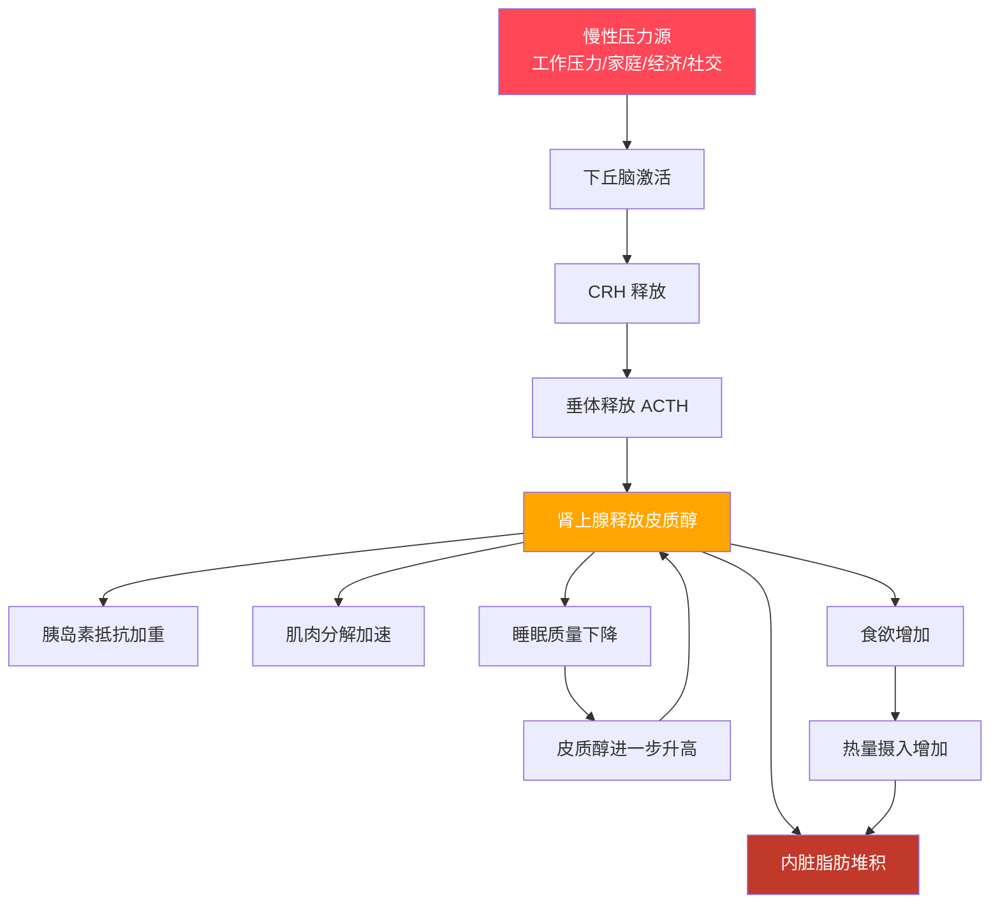

# 代谢基础知识

## 能量消耗的组成（TDEE）

每天的总能量消耗（TDEE）由四部分组成：

| 组分 | 占比 | 含义 | 可调控性 |
|------|------|------|---------|
| BMR（基础代谢率） | 60-70% | 维持生命所需的最低能量（呼吸、心跳、体温、细胞修复） | 中等（增加肌肉可提升） |
| NEAT（非运动活动热效应） | 15-20% | 日常非运动活动的消耗（走路、站立、打字、做家务、抖腿） | 高（主观行为直接影响） |
| TEF（食物热效应） | ~10% | 消化、吸收、代谢食物所消耗的能量 | 低（蛋白质 TEF 最高） |
| EAT（运动活动热效应） | 5-10% | 刻意运动（跑步、健身、游泳等）的消耗 | 高（但占总比例最小） |

> **核心认知：** 运动消耗只占 TDEE 的 5-10%，而基础代谢占 60-70%。这就是为什么"光靠运动不控制饮食"效果有限——你辛苦跑 40 分钟消耗的 300 kcal，一杯奶茶就抵消了。

### TEF 的营养素差异

| 营养素 | TEF（占该营养素热量的比例） | 说明 |
|--------|---------------------------|------|
| 蛋白质 | 20-30% | 吃 100 kcal 蛋白质，身体消化它要消耗 20-30 kcal |
| 碳水化合物 | 5-10% | |
| 脂肪 | 0-3% | 几乎不需要消耗能量就能吸收储存 |

> 这就是为什么高蛋白饮食在减脂中有优势：同等热量下，蛋白质的实际净摄入热量更低，且饱腹感更强。

## BMR 的影响因素

BMR 由 Mifflin-St Jeor 公式估算（见 nutrition-guide.md），但实际 BMR 受多种因素影响：

| 因素 | 影响 | 说明 |
|------|------|------|
| 瘦体重（肌肉量） | 最大正相关 | 每增加 1 kg 肌肉，BMR 约增加 13-15 kcal/天 |
| 年龄 | 负相关 | 30 岁后每 10 年 BMR 约下降 1-2%，主要因为肌肉流失 |
| 性别 | 男性 > 女性 | 主要因为男性平均肌肉量更多 |
| 身高 | 正相关 | 体表面积更大，散热更多 |
| 激素水平 | 甲状腺激素影响最大 | 甲亢 BMR 升高，甲减 BMR 降低 |
| 遗传 | 个体差异可达 ±10-15% | 即使同体重同体脂，BMR 也可能差 200-300 kcal/天 |
| 环境温度 | 极端温度增加 BMR | 寒冷时产热增加，炎热时散热耗能 |
| 疾病/炎症 | 发热、感染时升高 | 体温每升高 1°C，BMR 约增加 10-13% |

### 为什么减重后 BMR 会下降

减重后 BMR 下降是**正常的生理现象**，不是"代谢坏了"：

1. **体重减轻 → 维持更小的身体需要更少的能量**（这是最主要原因）
2. **肌肉流失 → 瘦体重减少 → BMR 进一步降低**
3. **代谢适应 → 身体通过激素调节主动降低能耗**（瘦素↓、甲状腺激素↓）

| 减重幅度 | BMR 预期下降 | 实际意义 |
|---------|-------------|---------|
| 5 kg | ~50-80 kcal/天 | 几乎不影响计划 |
| 10 kg | ~100-200 kcal/天 | 需要微调热量目标 |
| 15 kg+ | ~150-300 kcal/天 | 必须重新计算 TDEE |

> **关键数字：** 研究显示减重 10 kg 后的实际 BMR 下降中，约 75% 可以用体重/肌肉减少来解释，只有约 25% 是"额外的"代谢适应。代谢适应是真实存在的，但远没有传说中那么夸张。

## 能量平衡的动态模型

### 静态模型 vs 动态模型

传统的"3500 kcal = 1 磅脂肪"（约 7700 kcal = 1 kg 脂肪）是**静态模型**，假设代谢率永远不变。实际上身体是一个动态系统：

| 静态模型（错误） | 动态模型（正确） |
|----------------|----------------|
| 每天少吃 500 kcal，每周稳定减 0.5 kg | 前几周可能确实减 0.5 kg/周，但会逐渐变慢 |
| 减重速度恒定不变 | 减重曲线是渐近线，不是直线 |
| 不需要调整计划 | 每减 5-10 kg 需要重新评估热量目标 |

### 实际减重曲线

| 时间节点 | 典型表现（初始 TDEE 2000 kcal，目标 1500 kcal） |
|---------|----------------------------------------------|
| 第 1-2 周 | 快速下降 1-2 kg（部分是水分和糖原） |
| 第 3-4 周 | 稳定减重 0.5-0.8 kg/周 |
| 第 5-8 周 | 减重放缓到 0.3-0.5 kg/周（TDEE 已下降） |
| 第 9-12 周 | 可能需要重新计算 TDEE 或增加运动 |

## "饥荒模式"的真相

### 传言 vs 事实

| 传言 | 事实 |
|------|------|
| "吃太少会让代谢停止，反而变胖" | 代谢不会"停止"。极端节食会让 BMR 适度下降，但不会降到零 |
| "饿肚子会进入饥荒模式" | 所谓"饥荒模式"是代谢适应（metabolic adaptation），是可逆的生理反应 |
| "减肥必须吃够基础代谢，否则身体会储存脂肪" | 热力学定律不会因为少吃而被打破。热量缺口存在就会减重 |
| "节食会让身体把所有食物都变成脂肪存起来" | 不可能。没有热量盈余就无法合成新脂肪 |

### 代谢适应的真实情况

代谢适应确实存在，但程度远比想象中温和：

| 适应类型 | 幅度 | 说明 |
|---------|------|------|
| 激素驱动的 BMR 降低 | 约 5-15% | 瘦素↓、T3↓，身体主动节能 |
| NEAT 自发减少 | 100-400 kcal/天 | 减脂期人会不自觉地减少日常活动（少走、少动、更安静） |
| 肌肉流失导致 BMR 下降 | 取决于减重方式 | 纯节食不运动，肌肉流失更多 |
| 运动效率提升 | 10-20% | 身体做同样的运动更省力了 |

> **最被低估的代谢适应是 NEAT 下降。** 很多人减脂期不知不觉减少了日常活动——不走楼梯了、不抖腿了、坐得更久了。这部分可以占到"消失的热量缺口"的 40-50%。

### 明尼苏达饥饿实验的关键数据

1944-1945 年的明尼苏达饥饿实验是研究人类代谢适应的经典：

| 参数 | 数据 |
|------|------|
| 受试者 | 32 名健康男性 |
| 饮食 | 每日约 1570 kcal（维持量的约 55%） |
| 持续时间 | 24 周 |
| 平均减重 | 15.6 kg（约 25% 初始体重） |
| BMR 下降 | 约 40%（远超体重减少可解释的范围） |
| 恢复期 | BMR 在恢复饮食后逐渐回升 |

**教训：** 即使在极端饥饿条件下（热量不到维持量的一半），受试者依然持续减重。代谢下降了，但没有"停止"或"逆转"。

### 极端节食的真正危害

代谢适应不是节食的主要危害，以下才是：

| 危害 | 说明 |
|------|------|
| 肌肉大量流失 | 不运动 + 低蛋白 → 瘦体重减少 → BMR 大幅下降 → 减重后极易反弹 |
| 营养素缺乏 | 铁、钙、维生素 D、B 族维生素等不足 |
| 胆结石风险 | 快速减重（> 1.5 kg/周）胆结石风险增加 3-4 倍 |
| 免疫力下降 | 感染风险增加，伤口愈合变慢 |
| 心理问题 | 暴食、焦虑、抑郁、进食障碍风险 |
| 内分泌紊乱 | 女性闭经、男性睾酮下降 |
| 反弹循环 | 减重 → BMR 下降 → 恢复饮食 → 迅速反弹 → 更难减（因为肌肉少了） |

> **正确做法：** 每日热量缺口控制在 300-500 kcal（不超过 TDEE 的 20-25%），保证蛋白质摄入（1.5-2.0 g/kg 体重），配合运动保护肌肉。

## 肌肉量与代谢

### 肌肉是"代谢器官"

| 组织 | 每天每 kg 消耗热量 | 10 kg 差异 |
|------|-------------------|-----------|
| 脂肪组织 | ~4-5 kcal | — |
| 骨骼肌（安静时） | ~13-15 kcal | 比同重量脂肪多消耗 80-100 kcal/天 |
| 骨骼肌（运动时） | 可达 50+ kcal | — |

> 数字看起来不大，但肌肉的意义不仅仅是"多消耗一点热量"。

### 肌肉的代谢角色

1. **血糖缓冲区：** 肌肉是人体最大的葡萄糖储存库（糖原形式），肌肉量越大，餐后血糖波动越小
2. **胰岛素敏感性的关键：** 肌肉是胰岛素作用的主要靶组织，肌肉少 → 胰岛素抵抗风险增加
3. **氨基酸储备：** 免疫、修复、激素合成都需要氨基酸，充足的肌肉是健康储备
4. **活动能力保障：** 肌肉量决定了老年期的活动能力和跌倒风险

### 肌少症性肥胖

肌少症性肥胖（Sarcopenic Obesity）是指**体脂率高 + 肌肉量低**的状态，常见于：

| 人群 | 原因 |
|------|------|
| 反复节食减肥者 | 每次节食减掉脂肪和肌肉，恢复时只长脂肪 |
| 久坐不运动的减脂者 | 饮食控制但没有运动刺激，肌肉缺乏保护理由 |
| 中年人群 | 年龄相关的肌肉流失 + 体力活动减少 |

**为什么肌少症性肥胖比单纯肥胖更危险：**

| 指标 | 单纯肥胖 | 肌少症性肥胖 |
|------|---------|-------------|
| 胰岛素抵抗 | 较高 | 更高（肌肉是最大的葡萄糖处理器官） |
| BMR | 正常或偏高 | 偏低 → 更容易继续增重 |
| 跌倒/骨折风险 | 中等 | 高（肌肉无力 + 负重大） |
| 减重难度 | 中等 | 更难（BMR 低 + 活动能力差） |
| 心血管风险 | 高 | 更高 |

### 减脂期如何保护肌肉

| 策略 | 具体做法 | 证据强度 |
|------|---------|---------|
| 充足蛋白质 | 1.5-2.0 g/kg 体重/天 | 强 |
| 力量训练 | 每周 2-3 次，覆盖主要肌群 | 强 |
| 避免过大缺口 | 每日缺口 ≤ 500 kcal | 强 |
| 缓慢减重 | 每周 ≤ 1% 体重 | 中-强 |
| 运动后补充蛋白质 | 训练后 30 分钟内 20-30 g 蛋白质 | 中 |

## 肠道菌群与代谢

### 肠道菌群如何影响代谢

人体肠道内有约 38 万亿微生物（比人体细胞还多），它们在代谢中扮演重要角色：

### 短链脂肪酸（SCFA）

肠道菌群发酵膳食纤维后产生 SCFA，主要包括：

| SCFA | 功能 |
|------|------|
| 丁酸（butyrate） | 结肠细胞主要能量来源、抗炎、维持肠道屏障完整性 |
| 丙酸（propionate） | 抑制胆固醇合成、调节食欲 |
| 乙酸（acetate） | 被肝脏和外周组织利用，参与胆固醇代谢 |

### 肥胖人群的菌群特征

| 特征 | 肥胖者 vs 正常体重者 | 说明 |
|------|---------------------|------|
| 菌群多样性 | 降低 | 多样性低与肥胖、胰岛素抵抗相关 |
| 厚壁菌门/拟杆菌门比值 | 升高 | 争议较大，但多项研究观察到这一趋势 |
| 从食物中提取能量的效率 | 更高 | 意味着吃同样的食物，肥胖者可能吸收更多热量 |
| SCFA 产生模式 | 改变 | 丁酸产生菌减少 |

> **关键发现：** 将肥胖小鼠的肠道菌群移植给无菌小鼠后，无菌小鼠即使吃同样量的食物也会增加体脂。这说明菌群确实影响能量摄取和脂肪储存。

### 如何改善肠道菌群

| 策略 | 具体做法 | 作用 |
|------|---------|------|
| 多样化膳食纤维 | 每天摄入 25-35 g 膳食纤维，来源多样化（全谷物、蔬菜、豆类、水果） | 喂养有益菌，增加 SCFA 产生 |
| 发酵食品 | 酸奶、泡菜、纳豆、味噌 | 直接补充益生菌和代谢产物 |
| 减少精制碳水 | 白米饭、白面包、甜食 | 精制碳水促进有害菌和炎症相关菌增殖 |
| 限制人工甜味剂 | 三氯蔗糖、糖精等可能改变菌群组成 | 部分研究显示其通过菌群影响葡萄糖耐量 |
| 充足睡眠 | 见下文睡眠与代谢 | 肠道菌群有昼夜节律，睡眠紊乱扰乱菌群 |

> **务实态度：** 肠道菌群研究是前沿领域，因果关系尚未完全确定。目前已知的最佳策略就是多样化饮食 + 充足纤维。不需要购买益生菌补充剂，除非医生建议。

## 睡眠与代谢的深层联系

### 睡眠不足如何破坏减脂

| 睡眠不足的后果 | 数据 |
|--------------|------|
| 瘦素（饱腹信号）下降 | 睡眠限制 4 天后瘦素下降约 18% |
| 饥饿素（食欲信号）升高 | 睡眠限制后饥饿素升高约 28% |
| 额外热量摄入 | 睡眠不足者平均每天多吃 300-550 kcal |
| 脂肪分解减少 | 同样减重时，睡眠不足组多减肌肉少减脂肪 |
| 胰岛素敏感性下降 | 睡眠限制 4-5 天后胰岛素敏感性可下降 20-30% |

### 为什么"睡不好就瘦不了"

### 昼夜节律与代谢

| 代谢过程 | 昼夜节律特点 |
|---------|-------------|
| 胰岛素敏感性 | 早上最高，傍晚开始下降，晚上最低 |
| 葡萄糖耐量 | 上午 > 下午 > 晚上（同样食物晚上吃血糖反应更大） |
| 脂肪氧化 | 睡眠期间达到高峰（如果胰岛素水平足够低） |
| 皮质醇 | 清晨最高（帮助清醒），夜间最低 |
| 瘦素 | 夜间升高（告诉大脑不需要进食），白天下降 |

**实际意义：**

| 建议 | 原因 |
|------|------|
| 晚餐不要太晚（19:00 前完成） | 晚上胰岛素敏感性低，同样食物更容易转化为脂肪 |
| 保持规律作息（每天相近时间睡和起） | 昼夜节律紊乱 → 代谢紊乱 |
| 避免"社交时差"（周末晚睡晚起） | 即使 1-2 小时的偏移也足以影响代谢 |
| 睡前 3 小时不进食 | 让胰岛素在睡眠期间足够低，促进脂肪分解 |

### 睡眠呼吸暂停与代谢

超重/肥胖人群是阻塞性睡眠呼吸暂停（OSA）的高发人群：

| 数据 | 内容 |
|------|------|
| BMI > 30 者 OSA 患病率 | 约 40-60% |
| OSA 对代谢的影响 | 间歇性缺氧 → 胰岛素抵抗加重、交感神经激活、炎症标志物升高 |
| OSA 与脂肪肝 | OSA 患者脂肪肝风险增加 2-3 倍，且独立于 BMI |
| 打鼾自查 | 如果有人告诉你打鼾严重且有时会"停一下"，建议做睡眠监测 |
| 减重对 OSA 的改善 | 减重 10-15% 可显著改善甚至缓解轻度 OSA |

### 睡眠改善策略

| 策略 | 具体做法 |
|------|---------|
| 固定作息 | 每天同一时间上床和起床，包括周末 |
| 光照管理 | 早上接受 15-30 分钟日光照射，睡前 1 小时减少蓝光 |
| 睡眠环境 | 温度 18-22°C，全黑环境，安静 |
| 咖啡因截止 | 下午 2 点后不摄入咖啡因 |
| 睡前放松 | 洗热水澡、轻度拉伸、冥想，避免刺激性内容 |
| 时长目标 | 7-9 小时（成人推荐量） |

## 压力、皮质醇与代谢

### 皮质醇的代谢效应

皮质醇是主要的"压力激素"，由肾上腺分泌，在急性压力下有益，但**长期升高**会严重干扰代谢：

| 效应 | 机制 | 对减脂的影响 |
|------|------|-------------|
| 促进内脏脂肪堆积 | 激活内脏脂肪中的 11β-HSD1 酶，局部将皮质醇前体转化为活性皮质醇 | 腹部脂肪更难减 |
| 升高血糖 | 促进肝脏糖异生，降低肌肉葡萄糖摄取 | 胰岛素分泌增加 → 促进脂肪合成 |
| 促进肌肉分解 | 激活蛋白质分解代谢 | 瘦体重减少 → BMR 下降 |
| 增加食欲 | 与 NPY（神经肽 Y）协同，尤其增加对高糖高脂食物的渴望 | 情绪性进食 |
| 水钠潴留 | 促进肾脏保钠排钾 | 体重反弹（水重） |
| 抑制免疫系统 | 长期高皮质醇抑制免疫功能 | 恢复变慢，容易生病 |

### HPA 轴与慢性压力

### 压力管理的证据等级

| 策略 | 对降低皮质醇的证据 | 说明 |
|------|------------------|------|
| 规律运动 | 强 | 中等强度运动后皮质醇短期升高但基线水平长期降低 |
| 正念冥想 | 中-强 | 每天 10-20 分钟，8 周后皮质醇可降低 10-20% |
| 充足睡眠 | 强 | 睡眠与皮质醇互为因果 |
| 社交支持 | 中 | 有倾诉渠道的人皮质醇水平更低 |
| 深呼吸练习 | 中 | 激活副交感神经，快速降低皮质醇 |
| 自然暴露 | 中 | 户外活动 20+ 分钟可降低皮质醇 |
| 限制咖啡因 | 强 | 咖啡因直接刺激皮质醇分泌 |

## 减脂期的激素变化

减脂不是简单的数学题（少吃 = 变瘦），而是一场与激素系统的博弈：

| 激素 | 减脂期变化 | 影响 | 应对策略 |
|------|----------|------|---------|
| 瘦素（Leptin） | ↓↓ | 饱腹感减弱、代谢率下调 | Refeed Day / Diet Break |
| 饥饿素（Ghrelin） | ↑ | 食欲增加 | 高蛋白、高纤维饮食增加饱腹感 |
| 甲状腺激素（T3） | ↓ | BMR 下降 | Diet Break 让 T3 部分恢复 |
| 皮质醇 | ↑ | 肌肉分解、水潴留 | 管理压力、充足睡眠 |
| 睾酮（男性） | ↓ | 肌肉维持困难 | 力量训练 + 足够脂肪摄入 |
| 胰岛素 | 敏感性改善 | 好消息 | 这是减脂的核心益处之一 |

> **瘦素下降是减脂期最核心的激素挑战。** 瘦素主要由脂肪细胞分泌，脂肪减少 → 瘦素下降 → 大脑认为"能量不足"→ 增加食欲 + 降低代谢。这是身体对抗体重减少的防御机制。

## 实用总结：代谢知识如何指导减脂实践

| 代谢知识 | 实际行动 |
|---------|---------|
| BMR 占 TDEE 的 60-70% | 不要试图通过运动抵消糟糕的饮食 |
| 肌肉影响 BMR 和胰岛素敏感性 | 减脂期必须保留甚至增加肌肉（力量训练 + 高蛋白） |
| NEAT 可变幅度最大 | 有意识地增加日常活动，比加练一场更有效 |
| 代谢适应真实存在但被夸大 | 减重放缓时不恐慌，每减 5-10 kg 重新计算 TDEE |
| 睡眠直接影响食欲激素 | 睡眠是减脂的"隐形第三支柱"（饮食 + 运动 + 睡眠） |
| 皮质醇促进内脏脂肪堆积 | 压力管理不是奢侈品，是减脂的必要组成部分 |
| 肠道菌群影响能量提取 | 多样化纤维摄入是长期代谢健康的基础 |
| "饥荒模式"被严重夸大 | 热量缺口有效，关键是控制缺口大小和蛋白质摄入 |
