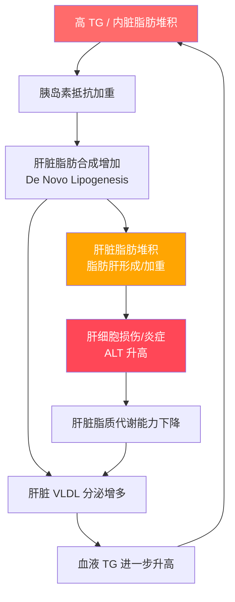

# 甘油三酯（Triglycerides, TG）

## 参考范围（中国标准）

| 分级 | 甘油三酯值 (mmol/L) | 甘油三酯值 (mg/dL) |
|------|---------------------|---------------------|
| 正常 | < 1.7 | < 150 |
| 边缘升高 | 1.7 - 2.25 | 150 - 199 |
| 升高 | 2.26 - 5.64 | 200 - 499 |
| 极高 | ≥ 5.65 | ≥ 500 |

> 参考：《中国成人血脂异常防治指南（2016 年修订版）》

## 流行病学数据

| 数据项 | 数值 |
|--------|------|
| 中国成年人高 TG 患病率 | 约 13-15%（2018 年全国调查） |
| 高 TG 在脂肪肝患者中的比例 | 约 50-60% |
| 高 TG + 脂肪肝同时存在的比例 | 约 40-50% 的 NAFLD 患者合并高 TG |
| 男性高发年龄段 | 40-50 岁 |
| 女性高发年龄段 | 绝经后（50-60 岁） |

> 高 TG 通常不是孤立存在——它往往是代谢综合征的"哨兵"，意味着胰岛素抵抗、内脏脂肪堆积已经发生。

## 升高的常见原因

1. **饮食因素**：高精制碳水（白米、白面、甜食）、高脂肪饮食、过量饮酒
2. **代谢因素**：胰岛素抵抗、肥胖（尤其腹型肥胖）、代谢综合征
3. **生活方式**：久坐不动、睡眠不足、压力过大
4. **疾病因素**：2 型糖尿病、甲状腺功能减退、肾脏疾病
5. **药物因素**：糖皮质激素、β受体阻滞剂、雌激素等

### 果糖与甘油三酯的特殊关系

果糖在肝脏中几乎全部被代谢，且不受能量平衡调控。大量摄入果糖会：

1. 直接促进肝脏新生脂肪合成（De Novo Lipogenesis, DNL）
2. 消耗肝脏 ATP，产生尿酸，进一步促进氧化应激
3. 诱导胰岛素抵抗，加重 TG 堆积

| 果糖来源 | 果糖含量 | 对 TG 的影响 |
|----------|---------|-------------|
| 一杯果汁（350ml） | 约 20-30g | 液体果糖吸收快，对 TG 冲击大 |
| 一瓶含糖饮料（500ml） | 约 25-40g | 是升高 TG 最快的单一食物 |
| 蜂蜜一勺（15g） | 约 8g | 适量影响不大，大量会增加肝脏脂肪合成 |
| 水果一份（150g） | 约 5-10g | 有纤维减缓吸收，影响较小 |

> **关键区别：** 液体果糖（果汁、含糖饮料）比固体水果中的果糖对 TG 影响大得多，因为缺少纤维延缓吸收。

## 高 TG 与脂肪肝的恶性循环

### 循环机制详解

| 步骤 | 机制 | 关键分子 |
|------|------|---------|
| 1. 高 TG → 胰岛素抵抗 | 游离脂肪酸增多，抑制胰岛素信号通路 | 游离脂肪酸（FFA）、TNF-α |
| 2. 胰岛素抵抗 → 肝脏脂肪合成 | 胰岛素不能有效抑制肝脏产糖和脂肪合成 | SREBP-1c（脂肪合成转录因子） |
| 3. 肝脏脂肪堆积 → VLDL 过量分泌 | 肝脏将多余脂肪打包为 VLDL 输出到血液 | VLDL、ApoB-100 |
| 4. VLDL 升高 → 血液 TG 升高 | VLDL 是血液中 TG 的主要载体 | 甘油三酯、胆固醇酯 |
| 5. 脂肪肝 → 肝功能下降 | 肝细胞受损后，脂质代谢效率下降 | ALT、AST、氧化应激产物 |

> **打破循环的关键：** 在任何环节干预都可以。减重减少内脏脂肪、控制碳水减少脂肪合成、运动提高胰岛素敏感性——都是切断这个循环的手段。

## 升高的危害

### 1. 急性胰腺炎

高 TG 是急性胰腺炎的第三大病因（仅次于胆结石和酒精），占所有病例的 5-25%。

| TG 水平 | 胰腺炎风险 |
|---------|-----------|
| < 5.65 mmol/L | 极低 |
| 5.65 - 11.3 mmol/L | 升高 |
| > 11.3 mmol/L | 显著升高（需紧急降脂） |

> 急性胰腺炎死亡率约 3-10%，重症胰腺炎死亡率可达 30%。高 TG 性胰腺炎的特点是容易复发、病情可能更重。

### 2. 心血管疾病

| 风险指标 | 数据 |
|---------|------|
| TG 每升高 1 mmol/L | 心血管事件风险增加约 15-20% |
| TG > 2.3 mmol/L vs < 1.0 mmol/L | 冠心病风险增加约 50-70% |
| 高 TG + 低 HDL | 心血管风险叠加效应，风险增加 2-3 倍 |
| 高 TG + 脂肪肝 | 心血管事件风险比单纯高 TG 高约 30% |

### 3. 促进脂肪肝进展

- 血液 TG 持续升高 → 肝脏脂肪堆积加速 → 单纯性脂肪肝向脂肪性肝炎（NASH）转化
- 脂肪肝患者的 TG 比非脂肪肝者平均高 0.5-1.5 mmol/L

### 4. 全因死亡率

多项大型队列研究显示，高 TG 是全因死亡率的独立预测因子，即使校正了其他血脂指标后仍然显著。

## 饮食干预要点

### 应减少的食物

- **精制碳水**：白米饭、白面包、糕点、含糖饮料
- **高果糖食物**：果汁、蜂蜜、高果糖玉米糖浆加工食品
- **饱和脂肪**：肥肉、黄油、奶油、棕榈油
- **反式脂肪**：油炸食品、人造奶油、部分加工零食
- **酒精**：尤其是啤酒和烈酒

### 推荐增加的食物

- **Omega-3 脂肪酸**：深海鱼（三文鱼、鲭鱼、沙丁鱼）、亚麻籽、核桃
- **膳食纤维**：燕麦、糙米、全麦、豆类、蔬菜、水果（低糖）
- **优质蛋白**：鸡胸肉、鱼肉、豆腐、鸡蛋
- **单不饱和脂肪**：橄榄油、牛油果

### 具体饮食建议

1. 每日碳水占总热量 45-50%，以全谷物为主
2. 每日脂肪占总热量 25-30%，减少饱和脂肪至 < 7%
3. 每日膳食纤维摄入 25-30g
4. 每周至少 2 次深海鱼
5. 完全戒酒或严格限制（男性 < 25g/天，女性 < 15g/天）

## 运动干预要点

- 有氧运动可有效降低甘油三酯 15-25%
- 每次运动持续时间 ≥ 30 分钟效果更佳
- 运动强度以中等为主（最大心率的 60-70%）
- 每周至少 150 分钟中等强度有氧运动

## 不同 TG 水平的干预策略

| TG 水平 | 优先干预 | 是否需要药物 |
|---------|---------|-------------|
| 1.7 - 2.25 mmol/L（边缘升高） | 饮食调整 + 运动，3 个月后复查 | 通常不需要 |
| 2.26 - 5.64 mmol/L（升高） | 严格饮食控制 + 规律运动，减重 5-10% | 视合并症而定，需医生评估 |
| ≥ 5.65 mmol/L（极高） | 立即饮食干预 + 就医 | 通常需要药物治疗，预防胰腺炎 |

> **降 TG 的"性价比"排序：** 戒酒/减含糖饮料 > 减精制碳水 > 减重 > Omega-3 > 运动。前三项的效果最为显著。
